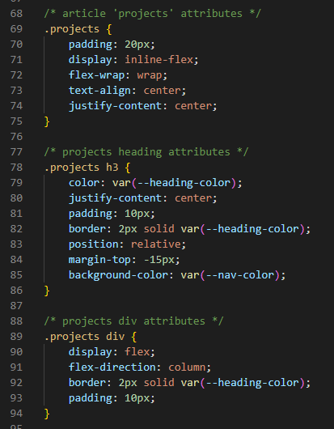

# My-Portfolio

## Description 

Welcome to my first ever portfolio website!

This project aims to showcase my ability in custom CSS styling by presenting my past projects in an adaptive card format:

I achieved this by learning and implementing flexbox displays:

Feel free to check out the [deployed website](https://zzzorigtbaatar.github.io/My-Portfolio/) as well as the [repository](https://github.com/zzzorigtbaatar/My-Portfolio).

In order to do this project, I used HTML, CSS, git, and github.

## Credits

* Jerome Chenette, UC Berkeley Extension Coding BootCamp

* https://css-tricks.com/snippets/css/a-guide-to-flexbox/

## License

[LICENSE](/LICENSE.md)

---

https://www.linkedin.com/in/zorizulkhuu/